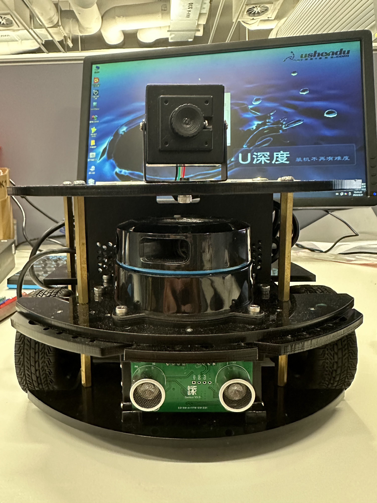
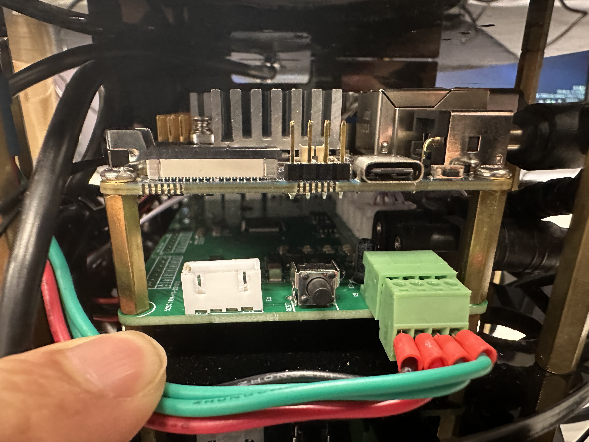

# Object detection and manipulation robot using Jetson Xavier NX GPU

## 1. Introduction
 





This is a GPU-based object detection and robot movement on a basic robot platform using NVIDIA Xavier NX. 

## 2. Hardware Requirements

### 2.1 Robot Platform
- Basic circular chassis with differential drive
- Two wheels and a ball caster
- Battery for power supply
- Robot Arm with suction end effector

### 2.2 Sensors
- Camera
- 2D lidar
- Ultrasound sensors
- Bump sensors
- Wheel encoders

### 2.3 Main Computer
- NVIDIA Xavier NX

### 2.4 Development Setup
- External computer for SSH access to Xavier NX
- Ethernet cable or Wi-Fi adapter for network connection

## 3. Software Requirements

- Ubuntu 18.04 LTS (comes pre-installed on Xavier NX) 
- ROS Melodic
- Python 3.6
- CUDA jetpack 4.6.5 (nvidia-l4t-cuda 32.7.2)
	- CUDA Toolkit 10.2 
	- cuDNN 8.2 
	- OpenCV 4.1.1 (with CUDA support) 
	- TensorRT 8.2.1.9
- PyTorch 1.9 (with CUDA support)
- Torchvision 0.10
- Numpy 1.19.4

### 3.2 Model 
- SSD Mobilenet-v2 UFF model, trained on 90-class MS-COCO

## 4 Setup

Install the [Jetson Inference library](https://github.com/dusty-nv/jetson-inference/tree/master) containing pre-trained models for Jetson devices.


#### Start ROS
```
// Open new Terminal 
roscore
```

### Compile workspace and configure env, launch base robot
```
// Open new terminal
catkin_make
source devel/setup.sh 
roslaunch arebot_base arebot_base.launch 
```

#### Launch main package
```
//Open new terminal
source devel/setup.sh
roslaunch detection detection.launch
```

